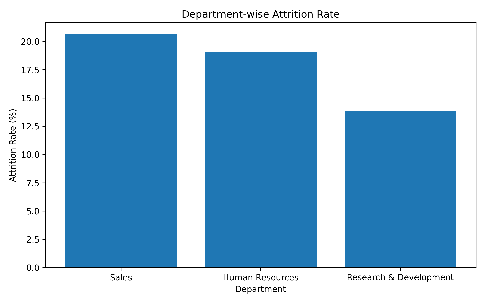
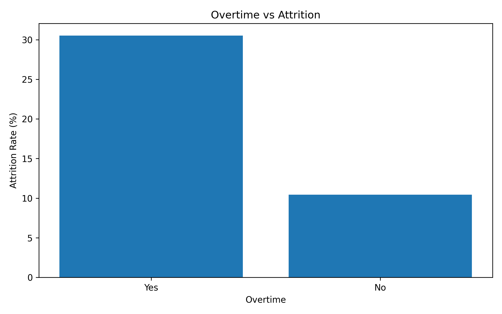
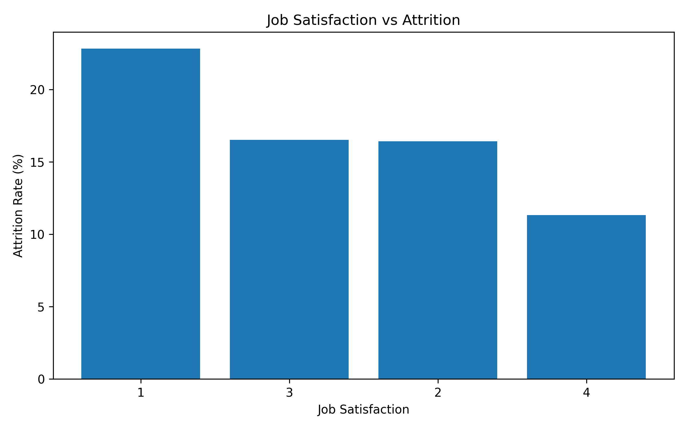

# HR Analytics using Python

## IBM Employee Attrition Analysis

### Project Overview

This project analyzes the IBM HR Analytics Employee Attrition dataset using Python to identify the major factors influencing employee turnover.

The analysis covers data inspection, data cleaning, exploratory data analysis (EDA), statistical analysis, visualization, and business recommendations. The objective is to support HR managers in making data-driven decisions to improve employee retention.

---

## Dataset

* Dataset: IBM HR Analytics Employee Attrition & Performance
* Total Employees: **1,470**
* Features: **35**

---

## Tools & Technologies

* Python
* Pandas
* NumPy
* Matplotlib
* Google Colab

---

## Project Workflow

1. Data Loading
2. Data Quality Assessment
3. Data Cleaning
4. Exploratory Data Analysis
5. Statistical Analysis
6. Business Insights
7. Recommendations

---

## Key Business Findings

* Overall employee attrition rate is approximately **16%**.
* Sales department has the highest attrition among all departments.
* Employees working overtime have significantly higher attrition.
* Lower job satisfaction is associated with increased employee turnover.
* Frequent business travel is linked to higher attrition.
* Employee experience has a strong positive relationship with monthly income.

---

## Business Recommendations

* Reduce excessive overtime.
* Improve employee engagement initiatives.
* Review compensation structures regularly.
* Improve work-life balance programs.
* Monitor departments and job roles with high attrition.
* Optimize business travel policies.

---

## Project Structure

```text
HR-Analytics-IBM-Python/
│
├── HR_Analytics_IBM_Project.ipynb
├── HR_Analytics_IBM.csv
├── README.md
├── requirements.txt
├── images/
```

---

## Skills Demonstrated

* Data Cleaning
* Exploratory Data Analysis (EDA)
* Data Visualization
* GroupBy & Aggregation
* Correlation Analysis
* Business Analytics
* HR Analytics
* Business Storytelling

---

## Sample Visualizations

### Department-wise Attrition



### Overtime vs Attrition



### Job Satisfaction vs Attrition



---

## Author

Bhupinder Kaur
